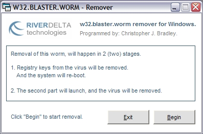



## w32\.blaster\.worm \(decom worm\) remover\.

### Description

Ok, it's been ages and ages since I have posted any code. Kind of got sick of people ripping code and making claim for their own, so I removed pretty much all code I ever posted. Anyway, things aside, this application will remove that DCOM Worm that was realeased. Pretty simple. I would like to take the time to add, that the registry code I used was from Master Spy's startup adder/remover. Basically because it was right there, and I was a lil too lazy to code it myself. Same goes for the shutdown code, which was from one of Federico Bridger's examples, for the same reason, heh. Enjoy.
 
### More Info
 

             |
---                |---
**Submitted On**   |2003-08-15 20:57:48
**By**             |[Chris Blaker](https://github.com/Planet-Source-Code/PSCIndex/blob/master/ByAuthor/chris-blaker.md)
**Level**          |Intermediate
**User Rating**    |3.0 (9 globes from 3 users)
**Compatibility**  |VB 6\.0
**Category**       |[Miscellaneous](https://github.com/Planet-Source-Code/PSCIndex/blob/master/ByCategory/miscellaneous__1-1.md)
**World**          |[Visual Basic](https://github.com/Planet-Source-Code/PSCIndex/blob/master/ByWorld/visual-basic.md)
**Archive File**   |[w32\_blaste1630118152003\.zip](https://github.com/Planet-Source-Code/chris-blaker-w32-blaster-worm-decom-worm-remover__1-47722/archive/master.zip)

